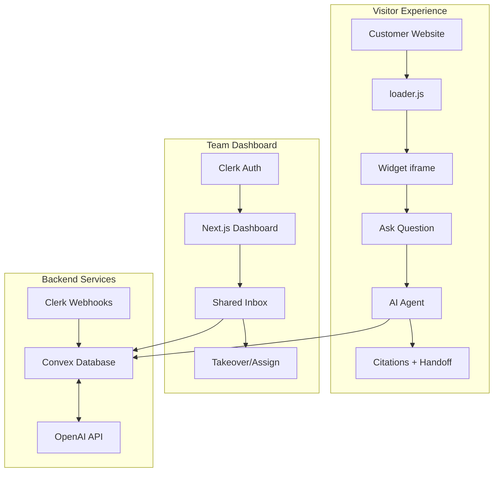

<div align="center">

# ZenCom — AI Customer Support Desk

### Intercom-style chat widget with AI agents, knowledge base, and real-time collaboration

[](https://nextjs.org/)
[](https://react.dev/)
[](https://convex.dev/referral/SONNYS4371)
[](https://go.clerk.com/vBypLmD)
[](https://platform.openai.com)
[](https://tailwindcss.com/)
[](https://www.typescriptlang.org/)
[](https://pnpm.io/)

</div>

> **⚠️ Educational Project Disclaimer:** This is a **learning-focused demonstration** built for educational purposes. "ZenCom" is a fictional name with no trademark claims. This project is **not affiliated with Intercom, Zendesk, Crisp, or any other customer support platform**. All data, conversations, and organizations are entirely fictional.

---

## ✨ Overview

ZenCom is a full-stack, real-time **B2B customer support platform** that combines:

- **AI-powered chat widget** with RAG (Retrieval-Augmented Generation) from your knowledge base
- **Real-time team inbox** with live presence and assignment capabilities
- **Multi-tenant architecture** with Clerk organizations and role-based access
- **No socket server required** — powered entirely by Convex's reactive database

<div align="center">

</div>

---

## 🎯 Key Features

### For Support Teams
- 📬 **Shared team inbox** with real-time updates and assignment
- 👥 **Live presence** — see who's online and viewing conversations
- 🔄 **AI ↔ Human takeover** — seamlessly switch between AI and human agents
- 🎯 **Smart filtering** — filter by status, mode, assignee, and more

### For Workspace Admins
- 📚 **Knowledge base management** — write articles or crawl your website
- 📄 **File ingestion** — upload PDFs and documents to your knowledge base
- 🎨 **Widget customization** — colors, logo, position, proactive messages
- 👤 **Team management** — invite members with admin/support roles
- 💳 **Billing integration** — subscription management via Clerk

### AI Agent Capabilities
- 🔍 **RAG-powered answers** — responds only from your knowledge base
- 📎 **Source citations** — cites relevant articles and documentation
- 🎣 **Lead capture** — automatically captures visitor contact information
- 🚨 **Human escalation** — hands off to agents when unsure
- 🛡️ **Prompt injection protection** — hardened security guardrails

---

## 🏗️ Architecture



### Data Flow

1. **Visitor** opens widget → asks question
2. **AI Agent** queries knowledge base via vector search
3. **Response** streams back with citations
4. **Team** sees conversation in real-time dashboard
5. **Agent takeover** switches to human mode instantly

---

## 🛠️ Tech Stack

| Layer | Technology | Purpose |
|-------|------------|---------|
| **Frontend** | Next.js 16, React 19, Tailwind CSS v4 | Modern web application |
| **UI Components** | shadcn/ui, Radix UI | Accessible, customizable components |
| **Backend** | Convex 1.41 | Reactive database, vector search, file storage |
| **Authentication** | Clerk v7 | Auth, organizations, B2B billing |
| **AI** | OpenAI, Vercel AI SDK v6 | Agent + embeddings (RAG) |
| **Real-time** | Convex Presence, Rate Limiter | Live updates, abuse prevention |

---

## 📋 Prerequisites

Create free accounts on these services:

| Service | Purpose | Free Tier |
|---------|---------|-----------|
| [Clerk](https://go.clerk.com/vBypLmD) | Authentication, organizations, billing | ✅ Yes |
| [Convex](https://convex.dev/referral/SONNYS4371) | Backend, database, vector search | ✅ Yes |
| [OpenAI](https://platform.openai.com) | AI agent, embeddings | ✅ Yes |
| [Vercel](https://vercel.com) | Deployment (optional) | ✅ Yes |

---

## 🚀 Quick Start

### 1. Clone & Install

```bash
git clone https://github.com/GiorgiKavtaradze-prog/ZenCom.git
cd ZenCom
pnpm install
```

### 2. Environment Setup

```bash
cp .env.local.example .env.local
```

```env
# Convex (auto-filled by `npx convex dev`)
NEXT_PUBLIC_CONVEX_URL=https://your-deployment.convex.cloud
NEXT_PUBLIC_CONVEX_SITE_URL=https://your-deployment.convex.site
CONVEX_DEPLOYMENT=dev:your-deployment

# Clerk (from https://go.clerk.com/vBypLmD)
NEXT_PUBLIC_CLERK_PUBLISHABLE_KEY=pk_test_xxx
CLERK_SECRET_KEY=sk_test_xxx

# Clerk routing
NEXT_PUBLIC_CLERK_SIGN_IN_URL=/sign-in
NEXT_PUBLIC_CLERK_SIGN_UP_URL=/sign-up
NEXT_PUBLIC_CLERK_SIGN_IN_FALLBACK_REDIRECT_URL=/dashboard
NEXT_PUBLIC_CLERK_SIGN_UP_FALLBACK_REDIRECT_URL=/dashboard

# Clerk Billing plan IDs
NEXT_PUBLIC_CLERK_PLAN_FREE_ID=cplan_xxx
NEXT_PUBLIC_CLERK_PLAN_PRO_ID=cplan_xxx
NEXT_PUBLIC_CLERK_PLAN_SCALE_ID=cplan_xxx
```

### 3. Configure Clerk

1. Create application in [Clerk Dashboard](https://go.clerk.com/vBypLmD)
2. Enable **Organizations** and **Billing**
3. Add `org_id` and `org_role` claims to JWT template
4. Create three plans: `free_org`, `pro`, `scale`
5. Set up webhook endpoint: `https://your-deployment.convex.site/clerk-webhook`

### 4. Configure Convex

```bash
# Start development server
npx convex dev

# Set environment variables
npx convex env set CLERK_JWT_ISSUER_DOMAIN https://your-instance.clerk.accounts.dev
npx convex env set CLERK_WEBHOOK_SIGNING_SECRET whsec_xxx
npx convex env set OPENAI_API_KEY sk-...
```

### 5. Run Development Servers

```bash
# Terminal 1 — Convex backend
npx convex dev

# Terminal 2 — Next.js frontend
pnpm dev
```

Or run both with a single command:

```bash
pnpm dev:all
```

Open [http://localhost:3000](http://localhost:3000) to get started!

---

## 📊 Database Schema

| Table | Purpose | Key Fields |
|-------|---------|------------|
| `workspaces` | Tenant (one per Clerk org) | `clerkOrgId`, `slug`, `ownerClerkUserId` |
| `workspaceMembers` | Org membership mirror | `clerkOrgId`, `clerkUserId`, `role` |
| `conversations` | Visitor ↔ agent thread | `workspaceId`, `visitorId`, `mode`, `status` |
| `messages` | Live transcript | `conversationId`, `author`, `body`, `isAi`, `citations` |
| `leads` | Captured contacts | `workspaceId`, `email`, `source`, `status` |
| `helpdeskArticles` | Help-center articles | `workspaceId`, `slug`, `category`, `status` |
| `knowledgeChunks` | Embedded RAG chunks | `workspaceId`, `source`, `text`, `embedding` |
| `widgetAppearance` | Widget styling | `themeColor`, `buttonColor`, `position` |
| `subscriptions` | Billing mirror | `clerkOrgId`, `planSlug`, `status`, `limits` |

---

## 🚢 Deployment

### Deploy to Vercel

```bash
pnpm install -g vercel
vercel
```

Or use the [Vercel GitHub integration](https://vercel.com/new).

### Deploy Convex to Production

```bash
npx convex deploy
```

Set all environment variables in the Convex production dashboard.

---

## 📈 Project Status

This project is in **active development** as an educational tutorial. See [BUILD_PLAN.md](BUILD_PLAN.md) for the detailed implementation roadmap.

| Phase | Status | Description |
|-------|--------|-------------|
| Phase 0 | ✅ Complete | Foundation, auth, schema |
| Phase 1 | ✅ Complete | Tenant re-key, org migration |
| Phase 2 | ✅ Complete | Billing + subscriptions |
| Phase 3 | ✅ Complete | KB ingestion (crawler, articles, files) |
| Phase 4 | ✅ Complete | AI agent + RAG + guardrails |
| Phase 5 | ✅ Complete | Takeover + realtime |
| Phase 6 | ✅ Complete | Widget UX + customizer |
| Phase 7 | ✅ Complete | Marketing + polish |

---

## 🤝 Contributing

This is an educational project. Feel free to fork it and adapt it for your own learning!

```bash
# Fork the repository
# Create your feature branch
git checkout -b feature/amazing-feature

# Commit your changes
git commit -m 'Add amazing feature'

# Push to the branch
git push origin feature/amazing-feature

# Open a pull request
```

---

## 📄 License

This project is shared for **educational purposes only**.

### ✅ You CAN
- Use for personal learning and education
- Fork and modify for non-commercial purposes
- Use as a portfolio project (with attribution)

### ❌ You CANNOT
- Use for commercial purposes without a separate license
- Sell or include in a paid product
- Remove attribution or license notice

---

## 🙏 Acknowledgments

- Built with ❤️ for learning purposes
- Inspired by Intercom, Crisp, and Zendesk
- Powered by the amazing Convex, Clerk, and OpenAI teams

---

<div align="center">
<sub>Educational Demo • Not for Production Use • MIT License</sub>
</div>