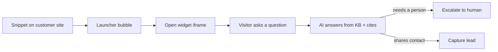
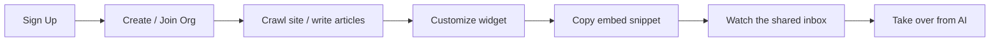
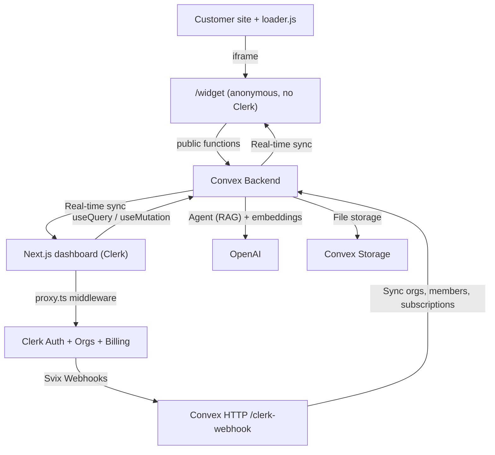

# MyChat — AI Customer Support Desk (Intercom-style) for Teams

[](https://nextjs.org/)
[](https://convex.dev/referral/SONNYS4371)
[](https://go.clerk.com/vBypLmD)
[](https://platform.openai.com)
[](https://tailwindcss.com/)
[](https://www.typescriptlang.org/)

> **⚠️ Disclaimer:** This is an **educational project** built for learning purposes only. "MyChat" is a fictional name used for this demo — we do not claim any trademark or intellectual property rights over it. This project is **not affiliated with, endorsed by, or connected to Intercom, Zendesk, Crisp, or any other customer-support platform**. All organization names, conversations, leads, and seed data are entirely fictional. Third-party service names (Clerk, Convex, Vercel, Next.js, OpenAI, Tailwind CSS, etc.) are trademarks of their respective owners and are used here solely to describe the technologies used in this project.

A full-stack, real-time **Intercom-style customer support desk** — a B2B multi-tenant SaaS where teams embed a chat + helpdesk **widget** on any website, let an **AI agent** answer from their own knowledge base, capture leads, and seamlessly **hand off to a human** in a shared team inbox.

> **Who is this for?**
> Anyone who wants to learn how to build a production-grade, multi-tenant B2B SaaS with an embeddable widget, AI/RAG, and billing using modern tools — or anyone looking for a serious starter template for their own support product.

> **What makes it different?**
> Every message is **real-time** (no page refreshes, no socket server to run). Auth, organizations, AND billing are handled by **Clerk** — no Stripe wiring required. The backend is powered by **Convex** — a reactive database that pushes changes to every connected client instantly. And there's a fully working **AI agent** (Convex Agent + OpenAI) that answers strictly from your knowledge base with vector search, citations, lead capture, and human escalation.

> **Under the hood**
> Next.js 16 App Router · Convex reactive backend · Clerk auth + organizations + B2B billing · Convex Agent + OpenAI (RAG) · Convex Presence · Convex Rate Limiter · AI SDK v6 · shadcn/ui + Radix · Tailwind CSS v4 · TypeScript strict mode

---

## 👇🏼 DO THIS Before You Get Started

You'll need free accounts on these services to run the app. **Set them up before cloning:**

| Service                 | What it does                                                 | Sign up                                                                  |
| ----------------------- | ------------------------------------------------------------ | ------------------------------------------------------------------------ |
| **Clerk**               | Authentication, organizations, and B2B subscription billing  | [Create a free Clerk account →](https://go.clerk.com/vBypLmD)            |
| **Convex**              | Real-time backend, database, vector search, and file storage | [Create a free Convex account →](https://convex.dev/referral/SONNYS4371) |
| **OpenAI**              | Powers the AI agent and embeddings (RAG)                     | [platform.openai.com →](https://platform.openai.com)                     |
| **Vercel** _(optional)_ | Deployment & hosting                                         | [vercel.com →](https://vercel.com)                                       |

---

## 🤔 What Is This App?

Think of MyChat as **your own mini Intercom** — an embeddable AI support widget plus a shared agent dashboard, built from scratch as a learning project.

It's a multi-tenant workspace app built on **two identity worlds** (the whole point):

- **Dashboard** = your customers (support agents). Authenticated with **Clerk Organizations**. One Clerk org → one workspace; the workspace `_id` is the public `app_id` that goes in the embed snippet.
- **Widget visitors** = anonymous people on customer sites. **No Clerk.** A `visitorId` is minted in `localStorage`, and their Convex calls only ever hit the _public_ functions.

**As a support agent**, you can:

- See every conversation live in a **shared team inbox** with unread + unassigned badges
- **Take over** any AI conversation instantly — the AI steps back, you reply as a human, hand it back when done
- Assign conversations, filter by status (open/closed), AI vs human mode, and assignee
- See **live presence** (who's online / viewing) powered by Convex Presence
- Manage captured **leads** (name, email, phone, source, status)

**As a workspace admin**, you can:

- Build a **knowledge base**: write helpdesk articles _or_ point the **website crawler** at your site and it builds the KB for you
- Ingest files (PDF/HTML) into the knowledge base
- **Customize the widget** — colors, logo, corner radius, position, title, proactive messages, and lead-capture fields
- Invite teammates and manage roles (admin / support)
- Upgrade the workspace and manage billing — checkout, plan changes, and invoices all handled by Clerk

**The AI agent** can:

- Answer visitor questions **only** from your knowledge base (RAG with a similarity threshold — no hallucinated answers)
- **Cite sources** and suggest relevant helpdesk articles
- **Capture leads** when a visitor volunteers their contact details
- **Escalate to a human** when it's unsure, out of scope, or the visitor asks for a person
- Send an **upgrade card** linking to billing when a visitor asks about pricing or limits
- Resist prompt injection / role-play / data-exfiltration via strict, hardened system instructions

**Popular use cases:**

- 🎓 **Portfolio project** — show off a real multi-tenant B2B SaaS with an embeddable widget and AI to employers
- 🚀 **SaaS starter** — fork it and turn it into your own support product
- 📚 **Learn the modern stack** — see exactly how Convex, Clerk billing, embeddable widgets, and RAG agents fit together

---

## 🚀 Before We Dive In — Join the PAPAFAM!

Want to build apps like this from scratch? Learn how to **code with AI the right way** — using Cursor and AI agents as force multipliers, not crutches.

### What You'll Master

- ⚡ **Next.js 16** — App Router, Server Components, route groups, and `proxy.ts` middleware
- 🔐 **Clerk** — Authentication, organizations, role-based access, and B2B subscription billing
- 🗄️ **Convex** — Real-time reactive backend, vector search, file storage, and schema design
- 🤖 **AI-Powered Development** — Learn to code with AI the right way: plan, parallelize, review, and ship with Cursor instead of blindly accepting output
- 🎨 **Modern UI** — shadcn/ui, Tailwind CSS v4, dark mode, and an embeddable Shadow-DOM widget

### The PAPAFAM Community

- 💬 Join thousands of developers building together
- 🏆 Real results from graduates who landed jobs and launched products
- 📦 Full course materials, starter code, and lifetime access

👉 **[Join the PAPAFAM and start building →](https://www.papareact.com/course)**

---

## ✨ Features

### Embeddable Widget

- 🧩 **One-snippet embed** — A framework-free, dependency-free `loader.js` a customer pastes onto any site. It renders the launcher bubble + chat iframe inside a **Shadow DOM** so the host page's CSS can't bleed in (and ours can't bleed out)
- 🌍 **True cross-origin embedding** — `frame-ancestors *` on `/widget` and CORS on `/loader.js` so it runs on any domain
- 💬 **Chat + Helpdesk tabs** — Live AI/human chat and a searchable help center in one widget
- 👋 **Proactive messages** — A host-side dwell timer fires a proactive nudge after N seconds
- 📝 **Lead capture form** — Configurable required fields (first name, last name, email, phone)
- 🔔 **Unread badge + notification sound** — Autoplay-gated to a prior user gesture
- 🎨 **Bubble pre-styling** — `GET /widget-config` styles the launcher _before_ the iframe even loads

### AI Agent (Convex Agent + OpenAI)

- 🤖 **Grounded RAG answers** — Embeds visitor questions and retrieves your workspace's knowledge chunks (1536-dim vectors via `text-embedding-3-small`); answers only when retrieval clears a cosine-similarity threshold (≈0.78), otherwise escalates instead of guessing
- 🧰 **8 server-scoped tools** — `search_knowledge_base`, `search_helpdesk_articles`, `get_faq`, `suggest_articles`, `capture_lead`, `escalate_to_human`, `send_upgrade_link`, `cannot_help`
- 🔒 **Hardened against prompt injection** — Retrieved KB text and visitor messages are treated as untrusted data, never instructions; the agent refuses role-play, prompt disclosure, and off-topic requests
- 🧷 **Tenant-safe by construction** — `workspaceId` / `conversationId` are baked into tool closures on the server, never taken from model free-text
- 🔁 **Streaming + human takeover** — Token-batched streaming placeholders, with an `agentRunEpoch` that aborts in-flight AI runs the moment a human takes over

### Knowledge Base

- 🕷️ **Website crawler** — Point it at a root URL; it crawls (bounded by max pages / depth), chunks, and embeds pages into retrievable knowledge
- 📄 **Helpdesk articles** — Markdown articles with categories, slugs, excerpts, cover images, draft/published status, and full-text search
- 📎 **File ingestion** — Extract text from PDFs (`unpdf`) and HTML (`node-html-parser`) into the KB
- 🔎 **Search + vector indexes** — Full-text search index on articles and a 1536-dim vector index on chunks, both defined in the schema
- ♻️ **Idempotent embedding** — Content is hashed (sha256) to dedupe chunks and avoid re-embedding unchanged text

### Inbox & Collaboration

- 📥 **Shared team inbox** — Every conversation in one reactive list with live unread/unassigned counts
- 🙋 **Human takeover** — Switch a conversation from AI → human and back; system messages log "joined" / "returned to AI"
- 🟢 **Live presence** — See who's online and viewing, powered by `@convex-dev/presence`
- 🗂️ **Assignment & roles** — Assign conversations; coarse `admin` / `support` roles mapped from Clerk org roles
- 🧲 **Leads pipeline** — Captured leads with status (new / contacted / closed), deduped per visitor

### Billing & Multi-Tenancy

- 🏢 **Clerk Organizations** — Every workspace is a Clerk organization; memberships and roles sync to Convex via Svix-verified webhooks
- 💳 **Clerk B2B Billing** — A custom-designed pricing page with `<PricingTable for="organization">`, per-plan `<CheckoutButton>`, plan management, and invoices handled entirely by Clerk (no Stripe integration to write)
- 🔐 **Plan gating, done right** — UI gates with `has({ plan })` / `has({ feature })` are cosmetic; **Convex mutations are the real enforcement** on the anonymous widget path
- 🚦 **Usage metering** — AI messages and KB documents are metered per billing period (Convex meters; Clerk does not), with limits mirrored onto each subscription row by the webhook
- ⏱️ **Rate limiting** — Abuse controls on the anonymous widget write surface via `@convex-dev/rate-limiter`

### Pricing Tiers

|                        | Free | Pro ($49/mo)       | Scale ($199/mo)      |
| ---------------------- | ---- | ------------------ | -------------------- |
| **AI messages/month**  | 100  | 2,000              | 20,000               |
| **Team seats**         | 2    | 10                 | 20                   |
| **KB documents**       | 10   | 200                | 2,000                |
| **Website crawler**    | —    | ✅ up to 200 pages | ✅ up to 2,000 pages |
| **Help center**        | ✅   | ✅                 | ✅                   |
| **Proactive messages** | —    | ✅                 | ✅                   |
| **Remove branding**    | —    | ✅                 | ✅                   |

_`free_org` is Clerk's auto-created default org plan, reused as Free. Plan slugs (`free_org`, `pro`, `scale`) match the Clerk Billing plan slugs that `has({ plan })` checks against._

### Technical Features (The Smart Stuff)

- ⚛️ **Next.js 16 App Router** — Route groups separate the Clerk-free marketing/widget surface from the `(app)` authenticated shell; `proxy.ts` (the Next 16 rename of `middleware.ts`) protects `/dashboard` and `/onboarding`
- 🔄 **Convex reactive backend** — No polling, no refetching. The widget and inbox are live subscriptions to the same `messages` table
- 🛡️ **Org-scoped auth boundary** — `requireOrgMember` / `requireAdmin` resolve the user, org, workspace, and role from the Clerk JWT's `org_id` / `org_role` claims and enforce tenant scoping on every authenticated function (Convex's answer to RLS)
- 🔐 **Clerk webhooks → Convex** — Organizations, memberships, and subscriptions sync via a single Svix-verified `/clerk-webhook` HTTP endpoint; Clerk stays the source of truth
- 🧩 **Convex components** — `@convex-dev/agent` (AI threads + streaming), `@convex-dev/presence` (live presence), `@convex-dev/rate-limiter` (abuse controls)
- 🪪 **Two identity worlds** — Authenticated agents (Clerk) and anonymous visitors (localStorage `visitorId`) share data through carefully separated public vs. authenticated Convex functions
- ✅ **Validators everywhere** — Every public Convex function validates args AND return values; TypeScript strict mode, no `any`

---

## 🔄 How It Works

### Visitor Flow



### Agent / Admin Flow



### Architecture Overview



---

## 🏁 Getting Started

### Prerequisites

- **Node.js** 18 or later
- **pnpm** (package manager) — `npm install -g pnpm`
- A **[Clerk](https://go.clerk.com/vBypLmD)** account
- A **[Convex](https://convex.dev/referral/SONNYS4371)** account
- An **[OpenAI](https://platform.openai.com)** API key (for the AI agent + embeddings)

### 1. Clone the repository

```bash
git clone <your-repo-url>
cd intercom-mvp
```

### 2. Install dependencies

```bash
pnpm install
```

### 3. Set up environment variables

Copy the example and fill it in:

```bash
cp .env.local.example .env.local
```

```env
# ---- Convex (auto-filled by `npx convex dev`) ----
NEXT_PUBLIC_CONVEX_URL=https://your-deployment.convex.cloud
NEXT_PUBLIC_CONVEX_SITE_URL=https://your-deployment.convex.site
CONVEX_DEPLOYMENT=dev:your-deployment

# ---- Clerk (from https://go.clerk.com/vBypLmD -> API keys) ----
NEXT_PUBLIC_CLERK_PUBLISHABLE_KEY=pk_test_xxx
CLERK_SECRET_KEY=sk_test_xxx

# Clerk routing
NEXT_PUBLIC_CLERK_SIGN_IN_URL=/sign-in
NEXT_PUBLIC_CLERK_SIGN_UP_URL=/sign-up
NEXT_PUBLIC_CLERK_SIGN_IN_FALLBACK_REDIRECT_URL=/dashboard
NEXT_PUBLIC_CLERK_SIGN_UP_FALLBACK_REDIRECT_URL=/dashboard

# ---- Clerk Billing plan ids (Clerk dashboard -> Billing -> Plans) ----
# Optional: used by the bespoke <CheckoutButton> on the pricing page.
NEXT_PUBLIC_CLERK_PLAN_FREE_ID=cplan_xxx
NEXT_PUBLIC_CLERK_PLAN_PRO_ID=cplan_xxx
NEXT_PUBLIC_CLERK_PLAN_SCALE_ID=cplan_xxx
```

> 🔒 **Security:** Never commit `.env.local` to git. The `NEXT_PUBLIC_` prefix means the value is exposed to the browser — only use it for public keys like `NEXT_PUBLIC_CLERK_PUBLISHABLE_KEY`. Server-only secrets (`OPENAI_API_KEY`, the webhook signing secret, the JWT issuer) live in the **Convex** deployment, not here.

### 4. Set up Clerk

1. Go to your [Clerk Dashboard](https://go.clerk.com/vBypLmD) and create a new application
2. Copy your **Publishable Key** and **Secret Key** into `.env.local`
3. Enable **Organizations** (Configure → Organizations) — this app is B2B; all work happens inside an org
4. Activate the **Convex integration** (Configure → Integrations → Convex). This provisions a JWT template named exactly `convex` with the `convex` audience. Make sure the template includes these custom claims so Convex knows the active org:

```json
{
  "org_id": "{{org.id}}",
  "org_slug": "{{org.slug}}",
  "org_role": "{{org.role}}"
}
```

5. Set up **Billing** (Configure → Billing) with three plans for **organizations**, using these exact slugs:
   - `free_org` — Free (Clerk's auto-created default org plan)
   - `pro` — $49/mo
   - `scale` — $199/mo
6. Attach **features** to the paid plans so `has({ feature })` works: `ai_messages`, `website_crawl`, `kb_documents`, `helpdesk`, `proactive_messages`, `remove_branding`
7. _(Optional)_ Copy each plan's `cplan_…` id into `.env.local` (`NEXT_PUBLIC_CLERK_PLAN_*_ID`) to enable the bespoke checkout buttons on the pricing page. If unset, the page falls back to Clerk's `<PricingTable>`.

### 5. Set up Convex

1. Run `npx convex dev` — this prompts you to create or link a project and auto-fills `CONVEX_DEPLOYMENT` / `NEXT_PUBLIC_CONVEX_URL`. **Leave it running** (it also generates types into `convex/_generated/`)
2. Set these environment variables on the Convex deployment (Convex dashboard → Settings → Environment Variables, or via the CLI):

```bash
# Trust Clerk-issued JWTs (must match the "convex" template's Issuer / Frontend API URL)
npx convex env set CLERK_JWT_ISSUER_DOMAIN https://your-instance.clerk.accounts.dev

# Verify Clerk webhooks (from step 6)
npx convex env set CLERK_WEBHOOK_SIGNING_SECRET whsec_xxx

# Power the AI agent + embeddings
npx convex env set OPENAI_API_KEY sk-...
```

> Until `CLERK_WEBHOOK_SIGNING_SECRET` is set, the webhook endpoint returns 500 **by design** rather than trust an unverified body. Until `OPENAI_API_KEY` is set, the AI agent degrades gracefully (escalates) instead of crashing.

### 6. Configure Clerk Webhooks

This is how Clerk keeps Convex in sync with organizations, memberships, and subscriptions.

1. In your Clerk dashboard, go to **Webhooks** and create a new endpoint
2. Set the URL to your Convex **HTTP Actions URL** + `/clerk-webhook`:
   - e.g. `https://your-deployment.convex.site/clerk-webhook` (note: `.convex.site`, **not** `.convex.cloud`)
3. Subscribe to these events:
   - `organization.created` / `organization.updated` / `organization.deleted`
   - `organizationMembership.created` / `organizationMembership.updated` / `organizationMembership.deleted`
   - All `subscription.*` and `subscriptionItem.*` events (this is how plan changes reach Convex)
4. Copy the **Signing Secret** and set it as `CLERK_WEBHOOK_SIGNING_SECRET` in your Convex env vars (step 5)

### 7. Run the development server

You can run the two processes in separate terminals:

```bash
# Terminal 1 — Convex backend (also generates types)
npx convex dev

# Terminal 2 — Next.js frontend
pnpm dev
```

…or run both at once:

```bash
pnpm dev:all
```

Open [http://localhost:3000](http://localhost:3000), sign up, create an organization on the onboarding screen, and you're in.

### 8. Try the full loop

1. In the dashboard, go to **Knowledge** → crawl your site or add an article, then **Customizer** to style the widget
2. Open the **Setup** tab → copy the embed snippet (it bakes in your workspace `app_id`) and click **Open demo site** to load `public/demo.html`
3. On the demo page, click the bubble and ask a question — the AI answers from your KB
4. Back in the **Inbox**, the conversation appears live. **Take over** and reply as a human — it shows in the bubble instantly

#### Testing TRUE cross-origin embedding

The demo page above is same-origin. To prove it works on a _different_ origin, serve `public/demo.html` from another port:

```bash
npx serve public -l 4000
# open: http://localhost:4000/demo.html?app_id=YOUR_ID&host=http://localhost:3000
```

#### (Optional) Seed demo data

```bash
npx convex run seed:run '{"clerkOrgId":"org_...","clerkUserId":"user_..."}'
```

### First-Time Setup Checklist

- [ ] Clerk account created and keys added to `.env.local`
- [ ] Clerk Organizations enabled
- [ ] Clerk `convex` JWT template active with `org_id` / `org_slug` / `org_role` claims
- [ ] Clerk Billing plans (`free_org`, `pro`, `scale`) and features configured
- [ ] Convex project linked; `CLERK_JWT_ISSUER_DOMAIN`, `CLERK_WEBHOOK_SIGNING_SECRET`, and `OPENAI_API_KEY` set in Convex env vars
- [ ] Clerk webhook pointing at `https://<deployment>.convex.site/clerk-webhook`
- [ ] `pnpm dev:all` runs without errors
- [ ] You can sign up, create an org, build a KB, embed the widget, and chat end-to-end

---

## 🗄️ Database Schema Overview

MyChat uses **Convex** with a flat, relational schema. All tables are defined in [`convex/schema.ts`](convex/schema.ts). New tenant/AI/billing fields stay `optional` permanently — presence is enforced in code (e.g. `requireOrgMember`), never by a schema-tightening re-push that could race live widget writes.

| Table                          | Purpose                                          | Key Fields                                                                      |
| ------------------------------ | ------------------------------------------------ | ------------------------------------------------------------------------------- |
| **workspaces**                 | One per Clerk org (the tenant)                   | `clerkOrgId`, `slug`, `ownerClerkUserId`                                        |
| **workspaceMembers**           | Mirror of Clerk org memberships (webhook-synced) | `clerkOrgId`, `clerkUserId`, `role`, `status`, `customAvatarStorageId`          |
| **conversations**              | A visitor ↔ agent/AI thread                      | `workspaceId`, `visitorId`, `mode`, `status`, `assignedClerkUserId`, `threadId` |
| **messages**                   | The live transcript the widget subscribes to     | `conversationId`, `author`, `body`, `isAi`, `citations`, `upgradeCard`          |
| **leads**                      | Captured contacts                                | `workspaceId`, `email`, `source`, `status`                                      |
| **helpdeskArticles**           | Markdown help-center articles                    | `workspaceId`, `slug`, `category`, `searchableText`, `status`                   |
| **knowledgeChunks**            | Embedded RAG chunks                              | `workspaceId`, `source`, `text`, `contentHash`, `embedding` (1536-dim)          |
| **crawlJobs** / **crawlQueue** | Website crawler jobs + per-job URL frontier      | `workspaceId`, `rootUrl`, `status`, `maxPages`, `maxDepth`                      |
| **widgetAppearance**           | Per-workspace widget styling                     | `themeColor`, `buttonColor`, `cornerRadius`, `position`, `logoStorageId`        |
| **widgetSettings**             | Widget behavior                                  | `proactiveMessage`, `leadCapture`, `faqEnabled`                                 |
| **subscriptions**              | Billing mirror (webhook-written)                 | `clerkOrgId`, `planSlug`, `status`, `seats`, `features`, `limits`               |
| **usage**                      | Quota counters keyed to the billing period       | `workspaceId`, `periodStart`, `aiMessages`, `kbDocuments`                       |

> **Note:** `@convex-dev/agent` and `@convex-dev/rate-limiter` own their own internal tables (threads, messages, streaming, rate-limit state) registered in [`convex/convex.config.ts`](convex/convex.config.ts) — these are **not** redefined in the schema. A `conversations.threadId` bridges our transcript to the agent's thread.

### Design Decisions

- **Two identity worlds** — Authenticated agents (Clerk) vs. anonymous visitors (`localStorage` `visitorId`). Public widget functions never touch authenticated data.
- **Clerk is the source of truth** — `workspaces`, `workspaceMembers`, and `subscriptions` are only ever written by webhooks. Feature code never writes to them directly.
- **Org scoping everywhere** — Every authenticated function runs through `requireOrgMember` / `requireAdmin`, which resolve the workspace from the JWT `org_id` claim before touching data.
- **Convex meters, Clerk bills** — Limits are snapshotted onto each subscription row so a plan-definition change doesn't silently re-gate existing subscribers until their next webhook.
- **Vector index locked to 1536 dims** — `text-embedding-3-small` native size; the vector index filters by `workspaceId` only (a vector filter can't AND two fields).

---

## 🚀 Deployment

### Deploy to Vercel

**Option A: Vercel CLI**

```bash
pnpm install -g vercel
vercel
```

**Option B: GitHub Integration**

1. Push your repo to GitHub
2. Go to [vercel.com/new](https://vercel.com/new)
3. Import your repository
4. Add all environment variables from `.env.local`
5. Deploy

### Deploy Convex to Production

```bash
npx convex deploy
```

Then set `CLERK_JWT_ISSUER_DOMAIN`, `CLERK_WEBHOOK_SIGNING_SECRET`, and `OPENAI_API_KEY` in the Convex **production** dashboard too.

### Post-Deployment Checklist

- [ ] All environment variables set in Vercel (including `NEXT_PUBLIC_` vars)
- [ ] All environment variables set in Convex production
- [ ] Clerk webhook endpoint updated to the **production** Convex HTTP Actions URL (`.convex.site/clerk-webhook`)
- [ ] Clerk **production** API keys used (not development keys)
- [ ] Clerk Organizations, the `convex` JWT template, and Billing configured on the production instance
- [ ] Replace `frame-ancestors *` in [`next.config.ts`](next.config.ts) with a per-workspace customer-domain allowlist
- [ ] Test sign-up → create org → build KB → embed widget → AI chat → human takeover → upgrade, end-to-end

---

## 🐛 Common Issues & Solutions

### Development

| Problem                            | Solution                                                                                                             |
| ---------------------------------- | -------------------------------------------------------------------------------------------------------------------- |
| Only one server starts             | Use `pnpm dev:all` (runs Next + Convex via `concurrently`), or run `npx convex dev` and `pnpm dev` in two terminals. |
| Convex types not updating          | Keep `npx convex dev` running. It generates types into `convex/_generated/`.                                         |
| Page shows a loading state forever | Check that `NEXT_PUBLIC_CONVEX_URL` is correct in `.env.local`.                                                      |

### Authentication & Organizations

| Problem                                | Solution                                                                                                                 |
| -------------------------------------- | ------------------------------------------------------------------------------------------------------------------------ |
| "Not authenticated" errors from Convex | The JWT template must be named exactly `convex`, and `CLERK_JWT_ISSUER_DOMAIN` must be set on the Convex deployment.     |
| Redirected to `/onboarding` in a loop  | The JWT template needs `org_id` / `org_slug` / `org_role` claims, and you must have an **active organization** selected. |
| Org created but no workspace in Convex | Webhook lag or misconfig — confirm the webhook endpoint ends with `/clerk-webhook` and uses the `.convex.site` domain.   |
| Webhook returns 400 / 500              | 400 = signature mismatch (check `CLERK_WEBHOOK_SIGNING_SECRET`). 500 = the secret isn't set on Convex yet.               |

### Billing & AI

| Problem                                  | Solution                                                                                                                                          |
| ---------------------------------------- | ------------------------------------------------------------------------------------------------------------------------------------------------- |
| Plan not updating after checkout         | Subscribe to all `subscription.*` **and** `subscriptionItem.*` events; `subscriptionItem.*` is the authoritative plan+status signal.              |
| Paid feature still gated after upgrade   | Gating is enforced in Convex from the mirrored `subscriptions` row — confirm the billing webhook fired and the row's `planSlug`/`status` updated. |
| AI says it can't help / always escalates | Either the KB is empty (crawl a site or add articles) or retrieval is below the similarity threshold. Add more relevant content.                  |
| AI errors immediately                    | Set `OPENAI_API_KEY` on the Convex deployment: `npx convex env set OPENAI_API_KEY sk-...`                                                         |

### Widget Embedding

| Problem                                  | Solution                                                                                                               |
| ---------------------------------------- | ---------------------------------------------------------------------------------------------------------------------- |
| `[MyChat] app_id is missing`             | Pass it via `?app_id=…` on the script `src`, a `data-app-id` attribute, or `window.MyChatSettings.app_id`.             |
| Widget won't load in an iframe elsewhere | `frame-ancestors *` (dev) must allow the host; the loader is fetched cross-origin via the CORS header on `/loader.js`. |
| Bubble shows default colors              | The `/widget-config` call failed or the `app_id` is invalid — it falls back to safe defaults by design.                |

---

## 🏆 Take It Further — Challenge Time!

Already have the base app running? Here are some ideas to make it your own:

### Product Features

- 🔐 **HMAC identity verification** — Let customers pass a server-signed, verified logged-in user instead of an anonymous, spoofable `visitorId`
- 🌐 **Per-workspace `frame-ancestors` allowlist** — Replace `*` with each workspace's verified customer domains
- 📧 **Email transcripts & offline replies** — Send conversation transcripts and follow up when no agent is online
- 🔔 **Inbox notifications** — Desktop/email alerts for new visitor messages and escalations

### AI Improvements

- 🧠 **Smarter retrieval** — Hybrid (full-text + vector) search and re-ranking before the answer
- 🗂️ **Auto-tagging & sentiment** — Classify conversations and flag frustrated visitors for priority
- 🤝 **Agent assist** — Suggested replies for humans, drafted from the KB
- 🌍 **Multilingual support** — Detect language and answer in kind

### Infrastructure & Scaling

- 📈 **Pagination** — Cursor-based pagination for inboxes with tens of thousands of conversations
- 🏷️ **Separate widget subdomain + CDN** — Serve `loader.js` from `widget.yourapp.com` behind a CDN
- 🍪 **Third-party cookie hardening** — If you add cookies, use `SameSite=None; Secure; Partitioned`

---

## 📋 Quick Reference

### Useful Commands

| Command                           | What it does                                           |
| --------------------------------- | ------------------------------------------------------ |
| `pnpm dev`                        | Start the Next.js dev server                           |
| `pnpm dev:all`                    | Start Next.js **and** Convex together (`concurrently`) |
| `pnpm build`                      | Build the Next.js app for production                   |
| `pnpm start`                      | Start the production server                            |
| `npx convex dev`                  | Start the Convex dev server (auto-generates types)     |
| `npx convex deploy`               | Deploy Convex to production                            |
| `npx convex dashboard`            | Open the Convex dashboard                              |
| `npx convex env set KEY value`    | Set an environment variable on the Convex deployment   |
| `npx convex run seed:run '{...}'` | Seed demo data for an org/user                         |

### Key Files & Folders

| Path                                        | Purpose                                                                   |
| ------------------------------------------- | ------------------------------------------------------------------------- |
| `app/page.tsx`, `app/pricing/`              | Public marketing landing + pricing (Clerk-free root layout)               |
| `app/(app)/`                                | Everything that needs Clerk (`Providers.tsx` = ClerkProvider + Convex)    |
| `app/(app)/dashboard/`                      | Inbox, leads, knowledge, customizer, team, billing, setup                 |
| `app/(app)/onboarding/`                     | Create-or-join-organization flow after sign-up                            |
| `app/widget/`                               | The public chat iframe — anonymous visitors, **no Clerk**                 |
| `public/loader.js`                          | The single embeddable snippet (bubble + iframe, Shadow DOM)               |
| `public/demo.html`                          | A fake "customer website" to test embedding                               |
| `convex/schema.ts`                          | Database schema — tables, search & vector indexes                         |
| `convex/http.ts`                            | Clerk webhook + public `/widget-config` HTTP endpoints                    |
| `convex/clerkWebhooks.ts`                   | Idempotent webhook upserts (orgs, members, subscriptions)                 |
| `convex/lib/auth.ts`                        | `requireOrgMember` / `requireAdmin` — the org-scoped auth boundary        |
| `convex/lib/plans.ts`                       | Canonical plan slugs, features, and limits Convex enforces                |
| `convex/agent/`                             | The AI agent: `index.ts` (agent + prompt), `tools.ts` (8 tools), `rag.ts` |
| `convex/crawler*.ts`, `convex/articles*.ts` | Website crawler + helpdesk article ingestion/embedding                    |
| `lib/planDisplay.ts`                        | Display metadata (price, tagline) layered over `convex/lib/plans.ts`      |
| `proxy.ts`                                  | Clerk middleware for route protection (Next.js 16)                        |
| `next.config.ts`                            | `frame-ancestors` for `/widget`, CORS for `/loader.js`                    |

### Important Concepts

- **Two Identity Worlds** — Authenticated agents (Clerk) vs. anonymous visitors (localStorage). Public widget functions and authenticated dashboard functions are deliberately separated.
- **Route Groups** — The root layout is Clerk-free (marketing + widget); `(app)` wraps the authenticated shell with `ClerkProvider` + `ConvexProviderWithClerk`.
- **Org-Scoped Functions** — `requireOrgMember` resolves `ctx` user/org/workspace/role from the Clerk JWT and rejects non-members. This is Convex's alternative to Row Level Security.
- **Clerk as Source of Truth** — Orgs, memberships, and subscriptions live in Clerk and are mirrored into Convex via Svix-verified webhooks.
- **Two-Layer Plan Gating** — `has({ plan })` / `has({ feature })` in the UI is cosmetic; the Convex limit checks on the widget path are the real enforcement.
- **Grounded AI** — The agent answers only from retrieved KB chunks above a similarity threshold, cites sources, and escalates instead of hallucinating.

---

## 📜 License & Disclaimer

This project is shared for **educational purposes only**.

### You CAN

- ✅ Use this project for **personal learning and education**
- ✅ Fork it and **modify** it for non-commercial purposes
- ✅ Use it as a **portfolio project** (with attribution)

### You CANNOT

- ❌ Use it for **commercial purposes** without a separate license
- ❌ Sell it or include it in a paid product
- ❌ Remove the attribution or license notice

### Trademark Notice

"MyChat" is a fictional name used for this educational demo. We do not claim any trademark, copyright, or intellectual property rights over this name. This project is **not affiliated with, endorsed by, or connected to Intercom, Zendesk, Crisp, or any other customer-support platform or company**. All third-party names and logos (Clerk, Convex, Vercel, Next.js, React, OpenAI, Tailwind CSS, TypeScript, etc.) are trademarks of their respective owners.
