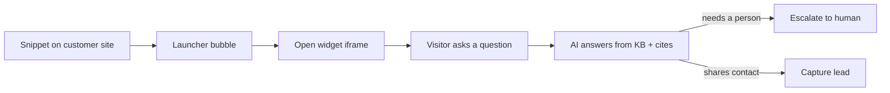
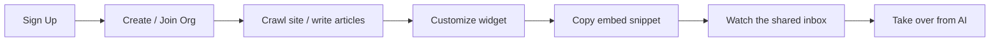
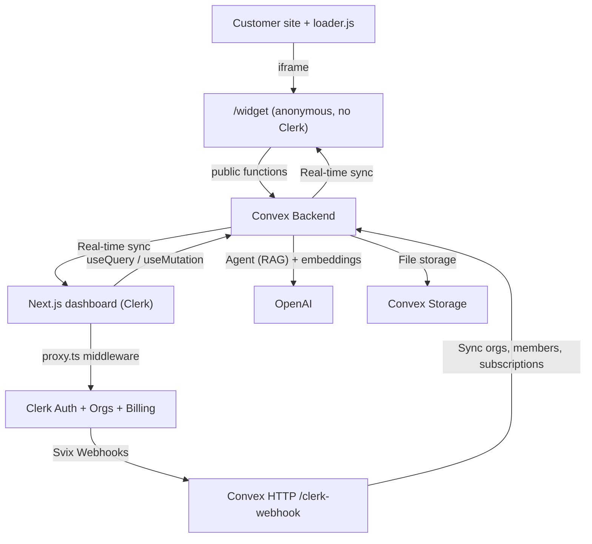

<div align="center">
  
  
  # ZenCom — AI Customer Support Desk (Intercom-style) for Teams

  [](https://nextjs.org/)
  [](https://convex.dev/referral/SONNYS4371)
  [](https://go.clerk.com/vBypLmD)
  [](https://platform.openai.com)
  [](https://tailwindcss.com/)
  [](https://www.typescriptlang.org/)
  [](LICENSE)
</div>

> **⚠️ Disclaimer:** This is an **educational project** built for learning purposes only. "ZenCom" is a fictional name used for this demo — we do not claim any trademark or intellectual property rights over it. This project is **not affiliated with, endorsed by, or connected to Intercom, Zendesk, Crisp, or any other customer-support platform**. All organization names, conversations, leads, and seed data are entirely fictional. Third-party service names (Clerk, Convex, Vercel, Next.js, OpenAI, Tailwind CSS, etc.) are trademarks of their respective owners and are used here solely to describe the technologies used in this project.

## Table of Contents

- [Overview](#overview)
- [Features](#features)
- [Tech Stack](#tech-stack)
- [Prerequisites](#prerequisites)
- [Getting Started](#getting-started)
- [Architecture](#architecture)
- [Database Schema](#database-schema)
- [Deployment](#deployment)
- [Project Status](#project-status)
- [Contributing](#contributing)
- [License](#license)

## Overview

A full-stack, real-time **Intercom-style customer support desk** — a B2B multi-tenant SaaS where teams embed a chat + helpdesk **widget** on any website, let an **AI agent** answer from their own knowledge base, capture leads, and seamlessly **hand off to a human** in a shared team inbox.

### Key Features

- **Real-time messaging** — No page refreshes, no socket server to run
- **Clerk Authentication** — Auth, organizations, AND billing handled by Clerk
- **Convex Backend** — Reactive database that pushes changes to every connected client instantly
- **AI Agent** — Answers strictly from your knowledge base with vector search, citations, and human escalation

## Features

### For Support Agents

- See every conversation live in a **shared team inbox** with unread + unassigned badges
- **Take over** any AI conversation instantly — the AI steps back, you reply as a human, hand it back when done
- Assign conversations, filter by status (open/closed), AI vs human mode, and assignee
- See **live presence** (who's online / viewing) powered by Convex Presence
- Manage captured **leads** (name, email, phone, source, status)

### For Workspace Admins

- Build a **knowledge base**: write helpdesk articles or use the **website crawler**
- Ingest files (PDF/HTML) into the knowledge base
- **Customize the widget** — colors, logo, corner radius, position, title, proactive messages, and lead-capture fields
- Invite teammates and manage roles (admin / support)
- Upgrade the workspace and manage billing

### AI Agent Capabilities

- Answer visitor questions **only** from your knowledge base (RAG)
- **Cite sources** and suggest relevant helpdesk articles
- **Capture leads** when a visitor volunteers their contact details
- **Escalate to a human** when unsure or out of scope
- Resist prompt injection via strict, hardened system instructions

## Tech Stack

- **Frontend:** Next.js 16 App Router, React 19, Tailwind CSS v4, shadcn/ui
- **Backend:** Convex (reactive database, vector search, file storage)
- **Authentication:** Clerk (Auth + Organizations + B2B Billing)
- **AI:** OpenAI (Agent + Embeddings), Vercel AI SDK v6
- **Real-time:** Convex Presence, Convex Rate Limiter

## Prerequisites

You'll need free accounts on these services to run the app:

| Service | Purpose | Sign up |
|---------|---------|---------|
| **Clerk** | Authentication, organizations, and B2B subscription billing | [Create a free Clerk account →](https://go.clerk.com/vBypLmD) |
| **Convex** | Real-time backend, database, vector search, and file storage | [Create a free Convex account →](https://convex.dev/referral/SONNYS4371) |
| **OpenAI** | Powers the AI agent and embeddings (RAG) | [platform.openai.com →](https://platform.openai.com) |
| **Vercel** (optional) | Deployment & hosting | [vercel.com →](https://vercel.com) |

## Getting Started

### 1. Clone the repository

```bash
git clone https://github.com/GiorgiKavtaradze-prog/ZenCom.git
cd ZenCom
```

### 2. Install dependencies

```bash
pnpm install
```

### 3. Set up environment variables

Copy the example and fill it in:

```bash
cp .env.local.example .env.local
```

```env
# ---- Convex (auto-filled by `npx convex dev`) ----
NEXT_PUBLIC_CONVEX_URL=https://your-deployment.convex.cloud
NEXT_PUBLIC_CONVEX_SITE_URL=https://your-deployment.convex.site
CONVEX_DEPLOYMENT=dev:your-deployment

# ---- Clerk (from https://go.clerk.com/vBypLmD -> API keys) ----
NEXT_PUBLIC_CLERK_PUBLISHABLE_KEY=pk_test_xxx
CLERK_SECRET_KEY=sk_test_xxx

# Clerk routing
NEXT_PUBLIC_CLERK_SIGN_IN_URL=/sign-in
NEXT_PUBLIC_CLERK_SIGN_UP_URL=/sign-up
NEXT_PUBLIC_CLERK_SIGN_IN_FALLBACK_REDIRECT_URL=/dashboard
NEXT_PUBLIC_CLERK_SIGN_UP_FALLBACK_REDIRECT_URL=/dashboard

# ---- Clerk Billing plan ids ----
NEXT_PUBLIC_CLERK_PLAN_FREE_ID=cplan_xxx
NEXT_PUBLIC_CLERK_PLAN_PRO_ID=cplan_xxx
NEXT_PUBLIC_CLERK_PLAN_SCALE_ID=cplan_xxx
```

### 4. Set up Clerk

1. Go to your [Clerk Dashboard](https://go.clerk.com/vBypLmD) and create a new application
2. Copy your **Publishable Key** and **Secret Key** into `.env.local`
3. Enable **Organizations** (Configure → Organizations)
4. Activate the **Convex integration** (Configure → Integrations → Convex)
5. Set up **Billing** with three plans: `free_org`, `pro`, `scale`
6. Add `org_id` and `org_role` claims to the `convex` JWT template

### 5. Set up Convex

```bash
# Start Convex dev server (generates types)
npx convex dev

# Set environment variables on Convex deployment
npx convex env set CLERK_JWT_ISSUER_DOMAIN https://your-instance.clerk.accounts.dev
npx convex env set CLERK_WEBHOOK_SIGNING_SECRET whsec_xxx
npx convex env set OPENAI_API_KEY sk-...
```

### 6. Configure Clerk Webhooks

1. In your Clerk dashboard, go to **Webhooks** and create a new endpoint
2. Set the URL to: `https://your-deployment.convex.site/clerk-webhook`
3. Subscribe to: `organization.*`, `organizationMembership.*`, and all `subscription.*` events

### 7. Run the development server

```bash
# Terminal 1 — Convex backend
npx convex dev

# Terminal 2 — Next.js frontend
pnpm dev
```

Or run both at once:

```bash
pnpm dev:all
```

Open [http://localhost:3000](http://localhost:3000) and you're in!

## Architecture

### Visitor Flow



### Agent / Admin Flow



### Architecture Overview



## Database Schema

| Table | Purpose | Key Fields |
|-------|---------|------------|
| **workspaces** | One per Clerk org (the tenant) | `clerkOrgId`, `slug`, `ownerClerkUserId` |
| **workspaceMembers** | Mirror of Clerk org memberships | `clerkOrgId`, `clerkUserId`, `role`, `status` |
| **conversations** | A visitor ↔ agent/AI thread | `workspaceId`, `visitorId`, `mode`, `status`, `assignedClerkUserId` |
| **messages** | The live transcript | `conversationId`, `author`, `body`, `isAi`, `citations` |
| **leads** | Captured contacts | `workspaceId`, `email`, `source`, `status` |
| **helpdeskArticles** | Markdown help-center articles | `workspaceId`, `slug`, `category`, `status` |
| **knowledgeChunks** | Embedded RAG chunks | `workspaceId`, `source`, `text`, `embedding` (1536-dim) |
| **widgetAppearance** | Per-workspace widget styling | `themeColor`, `buttonColor`, `cornerRadius`, `position` |
| **subscriptions** | Billing mirror | `clerkOrgId`, `planSlug`, `status`, `limits` |

## Deployment

### Deploy to Vercel

```bash
pnpm install -g vercel
vercel
```

Or use the [Vercel GitHub integration](https://vercel.com/new).

### Deploy Convex to Production

```bash
npx convex deploy
```

Set all environment variables in the Convex production dashboard.

## Project Status

This project is currently in **active development** as an educational tutorial. See the [BUILD_PLAN.md](BUILD_PLAN.md) for the detailed implementation roadmap.

## Contributing

This is an educational project. Feel free to fork it and adapt it for your own learning purposes!

## License

This project is shared for **educational purposes only**.

### You CAN

- ✅ Use this project for **personal learning and education**
- ✅ Fork it and **modify** it for non-commercial purposes
- ✅ Use it as a **portfolio project** (with attribution)

### You CANNOT

- ❌ Use it for **commercial purposes** without a separate license
- ❌ Sell it or include it in a paid product
- ❌ Remove the attribution or license notice

### Trademark Notice

"ZenCom" is a fictional name used for this educational demo. This project is **not affiliated with, endorsed by, or connected to Intercom, Zendesk, Crisp, or any other customer-support platform**. All third-party names and logos are trademarks of their respective owners.

---

<div align="center">
  <sub>Built with ❤️ for learning purposes</sub>
</div>